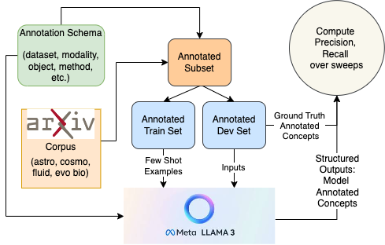
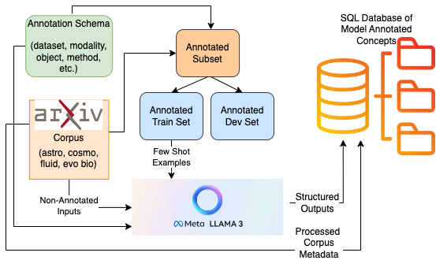

# Mapping the Data Landscape For Generalizable Scientific Models

We introduce a method to build a knowledge base to store structured information extracted from scientific publications, datasets and articles by leveraging large language models!

We want to cover all of "science", and perform semantic search over scientific literature for highly specific knowledge discovery. 

This tool helps us to find aggregate information and statistics pertaining to current state of scientific research, identify the gaps where current foundation models lack coverage and where they can generalize well, and helps discover overlaps of methods used across different fields, which can help facilitate in building more unified foundation models for science. 

### Example Preview: Concept Co-occurrence Connectivity Graph for Astrophysics!


https://github.com/user-attachments/assets/d0c2c4ac-924d-4ba8-80d5-5c665d910652


We use the Llama-3-70B-Instruct model with 2 A100 80GB GPUs for structured information extraction. 

## Workflow

<table>
  <tr>
    <td width="50%" valign="top">
      
      <p align="center">
        <em>Fig 1: Prompt optimization pipeline to maximize precision of the model annotated 
        predictions by running on manually annotated subset of scientific corpora. The 
        tagged outputs can be generated as JSON or in a readable format, and be 
        generated using temperature and nucleus sampling (sweep hyperparams).</em>
      </p>
    </td>
    <td width="50%" valign="top">
      
      <p align="center">
        <em>Fig 2: Illustration of the structured prediction pipeline on the full corpus of 
        scientific papers, which runs optimized prompts and stores the model's outputs in 
        a SQL db.</em>
      </p>
    </td>
  </tr>
</table>

## Installation 

Clone and navigate to the repository:
```
git clone https://github.com/chiral-carbon/kg-for-science.git
cd kg-for-science
```
Create a conda or virtual environment:
```
conda env create -f environment.yml
```
Activate the environment:
```
conda activate kg4s
```
Set up code formatting and pre-commit hooks:
```
pre-commit install
```
## Quickstart

### Run an existing DB

To run an existing database in the `databases` directory, run SQLite in your terminal in the project root:

```
sqlite3 databases/<table_name>
```

### Launch a Gradio interface for SQL query search over the created databases
```
gradio scripts/run_db_interface.py
```
The interface shows all the created databases in the `data/databases` directory which can be loaded and queried.


## Running the tool on new data 

### Download raw data from arXiv

Run `scripts/collect_data.py` to download papers for arXiv:
```
python scripts/collect_data.py --max_results 1000 --search_query astro-ph --sort_by 'last_updated_date' --sort_order desc --out_dir <dir name>
```

These are the default arguments, you can modify them to specify the arxiv channel, number of papers and order of search. 

The data is stored in the `data/raw/<out_dir>` directory.
The `out_dir` is a required argument that creates a new directory in `data/raw` and stores the scraped data in a jsonl file inside `data/raw/<out_dir>`. Refer to the [raw data README](data/raw/README.md) to see how the files are named. 

### Schema and Annotations

A schema was prepared by the authors of this project who were also the annotators for a small subset of the downloaded papers. 
This schema defined tags to extract concepts from the downloaded scientific papers. They were used as reference by the annotators when manually creating a small subset of annotated papers. They were also passed as instructions to the language model to tag the papers. A set of consituency tests were also defined to resolve ambiguity and guide the annotation process. 

The schema, tests and manual_annotations are stored in the `data/manual` directory. Refer to the [README on manual work](data/manual/README.md) done for the extraction process.


### Run the model on downloaded arXiv raw data

Run `main.py` to call Llama-3 70B Instruct and perform extractions on the downloaded papers from any of the `data/raw` folders using Slurm jobs:
```
sbatch run.sh
```
You can modify the arguments passed to `main.py` as required:
- evaluation on dev set or extracting data with a new test dataset,
- specifying the format of model responses (json or readable).

You can view the options by running `python main.py --help`:
```
Usage: main.py [OPTIONS]

Options:
  --kind TEXT              Specify the kind of prompt input: json (default) or
                           readable
  --runtype [new|eval]     Specify the type of run: new or eval (default)
  --data TEXT              Specify the directory of the data if running on new
                           data
  --sweep                  Run sweeps
  --sweep_config TEXT      Sweep configuration file
  --load_best_config TEXT  Load the best configuration from a file
  --help                   Show this message and exit.
```

If bound by compute resources and unable to use the Llama-3-70B-Instruct model, you can choose a different model if limited by memory and GPU.  Since we use the Huggingface transformers library and the model hosted on Huggingface, any new model you want to load should be hosted there as well. 

**Note:** In the eval mode when running on the dev set, the model was run for different sweeps for prompt optimization. The sweep details are stored in `sweep_config.json`.

To load a different model, change the `DEFAULT_MODEL_PATH` value in `config.py` to the Huggingface `<repo_name>/<model_name>` that you want. 


The current best performance on the dev set:

| Metric | kind=json | kind=readable |
|--------|-----------|---------------|
| precision | 0.4329 | 0.4364 |
| recall | 0.3974 | 0.3110 |
| f1 | 0.4144 | 0.3632 |
| union_precision | 0.5864 | 0.6242 |
| union_recall | 0.5216 | 0.4459 |
| union_f1 | 0.5521 | 0.5202 |
| avg_time_per_sentence | 4.0315 | 2.7584 |
| total_time | 463.6508 | 317.2468 |


The processed data gets stored in `data/raw/results` under new directories named with arguments passed to `main.py`. Refer to the [results README](data/results/README.md) for inspecting the files that each directory stores and the naming convention.

### Create a SQLite3 database of the predictions
```
python scripts/create_db.py --data_path <path to the jsonl file with data> --pred_path <path to the predictions.json file>
```
This creates a database in the `data/databases` directory. 
```
Usage: create_db.py [OPTIONS]

Options:
  --data_path TEXT         Path to the data file containing the papers
                           information.
  --pred_path TEXT         Path to the predictions file.
  --db_name TEXT           Name of the database to create.
  --force                  Force overwrite if database already exists
  --help                   Show this message and exit.
  ```

All current databases are in the ```data/databases``` directory which can be downloaded and loaded with ```sqlite3``` to run queries on your own terminal. Refer to the [databases README](data/databases/README.md) for information on the tables that constitute each of the databases.


## Relevant Resources for Reference
### Tools
- Nomic AI's Atlas has beautiful and interactive visualizations and also provides an embedding API for visualizing knowledge graphs | [Site](https://atlas.nomic.ai/) | [GitHub](https://github.com/nomic-ai/nomic)
- Instagraph is a good starting point for KG viz. They generate the knowldge graph (nodes and edges) given a knowledge base using GPT 3.5 | [Site](https://instagraph.ai) | [GitHub](https://github.com/yoheinakajima/instagraph)
- The Monarch Initiative has a neat interface for phenotype/gene/disease knowledge discovery | [Site](https://next.monarchinitiative.org) | [GitHub](https://github.com/monarch-initiative)
- PaperQA: LLM Chain for answering questions from documents with citations | [GitHub](https://github.com/whitead/paper-qa)

### Research Papers
- Knowledge Graph in Astronomical Research with Large Language Models: Quantifying Driving Forces in Interdisciplinary Scientific Discovery | [arXiv](https://arxiv.org/pdf/2406.01391)
- Graph of Thoughts: Solving Elaborate Problems with Large Language Models | [arXiv](https://arxiv.org/pdf/2308.09687)
- Bring Your Own KG: Self-Supervised Program Synthesis for Zero-Shot KGQA | [arXiv](https://arxiv.org/pdf/2311.07850)
